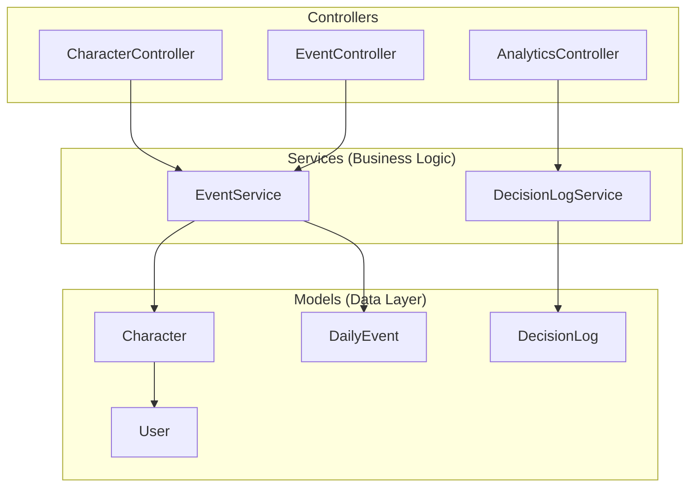
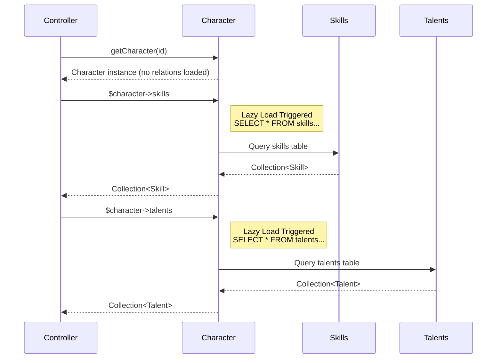
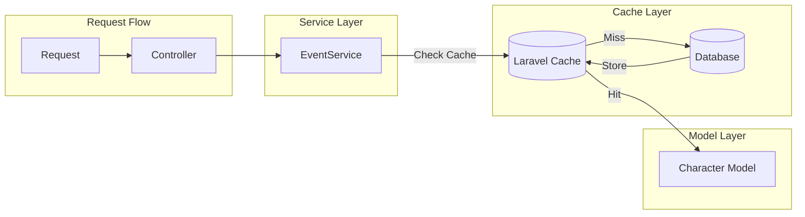

# ULife Architecture - Modular Logic & Lazy Loading

## Overview
This document shows the modular architecture and lazy loading patterns used in the ULife Laravel application.

---

## 1. Modular Service Architecture



### Modular Services Implementation

| Service | Responsibility | Location |
|---------|---------------|----------|
| [`EventService`](app/Services/EventService.php) | Event generation, branching logic, state transitions | 29068 chars |
| [`DecisionLogService`](app/Services/DecisionLogService.php) | Decision logging, analytics data | 7161 chars |

---

## 2. Lazy Loading with Eloquent Relationships



### Eloquent Lazy Loading Examples

**Character Model** - [`app/Models/Character.php`](app/Models/Character.php:120)

```php
// Lazy loading relationships - only loaded when accessed
public function user(): BelongsTo
{
    return $this->belongsTo(User::class);  // Line 123-126
}

public function skills(): BelongsToMany
{
    return $this->belongsToMany(Skill::class, 'character_skill');  // Line 131-134
}

public function talents(): BelongsToMany
{
    return $this->belongsToMany(Talent::class, 'character_talent');  // Line 139-142
}
```

---

## 3. Cache-Ready Architecture (For Future Lazy Caching)



### Recommended Caching Pattern

```php
// Example: Adding lazy loading cache to EventService
public function getEventsForAgeGroup(string $ageGroup): Collection
{
    return Cache::remember("events.{$ageGroup}", 3600, function () use ($ageGroup) {
        return DailyEvent::where('age_group', $ageGroup)->get();
    });
}
```

---

## 4. Project Structure Summary

```
app/
├── Http/Controllers/     # Modular controllers
│   ├── CharacterController.php
│   ├── EventController.php
│   └── AnalyticsController.php
├── Services/            # Business logic (MODULAR)
│   ├── EventService.php      # Event branching & state
│   └── DecisionLogService.php # Decision logging
└── Models/              # Data layer with lazy loading
    ├── Character.php         # Eloquent relationships
    ├── User.php
    └── DecisionLog.php
```

---

## Key Patterns Demonstrated

1. **Modular Logic**: Services encapsulate business logic separate from controllers
2. **Lazy Loading**: Eloquent relationships load only when accessed (`->skills`, `->talents`)
3. **Separation of Concerns**: Controllers → Services → Models workflow

---

*Generated: 2026-03-15*
